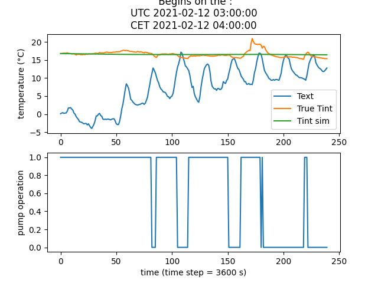

# Résultats obtenus pour le modèle RC sur le collège Marc Bloch 

Tous les tests ont été effectués sur la base des données du bâtiment Nord (pour la température intérieure ainsi que les températures de départ 
et de retour du circuit d'eau).

### Durée de la simulation : 10 jours 

Pour tous les résultats ci-dessous, on a pris :
* une capacité calorifique de l'eau de *1162.5 Wh/m3/K* ;
* une fenêtre de *10 jours* ; 
* un débit de *5 m3/h* ; 
* un delta T (entre les températures de départ et d'arrivée) de *10*. 

Date de début | R | C | Valeurs initiales 
---|---|---|---
20/02 | 2.64850632e-04 | 3.99920238e+08 | [1e-5, 1e8]
27/02 | 2.99444995e-04 | 7.57208244e+08 | [1e-5, 1e8]
05/03 | 3.42506838e-04 | 1.06209090e+09 | [1e-5, **1e9**]
18/03 | 3.14307842e-04 | 5.15186005e+08 | [1e-5, 1e8]
05/04 | 2.47025473e-04 | 1.09630532e+09 | [1e-5, 1e8]

**Observations pour cette fenêtre** :
* si la fenêtre correspond uniquement à une période de vacances, la température simulée sera toujours constante (cf. figure ci-dessous). En effet, l'absence des variations caractéristiques pour la température de départ en semaine ne permet pas d'obtenir une convolution satisfaisante. 

* À certaines dates (c'est notamment le cas de la première moitié de mars), il a fallu changer les paramètres des valeurs initiales pour l'optimisation afin que l'exponentielle contenue dans le calcul de la convolution ne tende pas vers l'infini. 

### Durée de la simulation : 20 jours 

On augmente le temps de la simulation à 20 jours, toutes choses égales par ailleurs. On pourra mettre à jour la valeur des poids au besoin. 

Date de début | R | C | Valeurs initiales  
---|---|---|---
20/02 | 3.08814171e-04 | 8.63446560e+08 | [1e-5, 1e8]
04/03 | 3.19412465e-04 | 8.87378799e+08 | [1e-5, **1e9**]
29/03 | 1.37565505e-05 | 1.08216951e+11 | [1e-5, 1e8]

**Oservations pour cette fenêtre :**
* Les résultats semblent assez similaires à ceux obtenus pour une période de 10 jours. Il y a notamment le même 'problème' de température plate lorsque l'on se positionne pendant les vacances, et ce même sur une plus longue période de temps. 

### Influence du delta de température 

La différence de température entre le départ et le retour du circuit d'eau a été fixée arbitrairement : 
* Sur les courbes de températures disponibles sur Emoncms, on observe un deltat T d'environ 1°C ;
* Or, dans la majorité des cas, l'installation de chauffage a été dimensionnée afin que le delta T soit de 10°C environ. C'est cette valeur qui a été utilisée plus haut pour les différents tests. 

On peut alors s'intéresser à l'influence de ce paramètre sur les valeurs de R et de C. On fait tourner le modèle avec les paramètre suivants :
* débit massique de *5 m3/h* ; 
* date de début de simulation : 18/03 ; 
* taille de la fenêtre de simulation : *10 jours* ; 
* valeurs initiales : *[1e-5, 1e8]*.

Ci-dessous, les résultats obtenus pour différentes valeurs de delta T : 

Delta T | R | C 
--|--|--
10 | 3.14307842e-04 | 5.15186005e+08
1 | 3.14308637e-03 | 5.15181664e+07
100 | 3.14308348e-05 | 5.15179686e+09

On observe une dépendance linéaire des valeurs de R et de C par rapport au delta T. 

### Influence du débit

De la même manière, le débit a été fixé arbitrairement car sa valeur n'a pas été mesurée lors de l'instrumentation du collège. Pour les tests ci-dessus, on a utilisé un débit de 5 m3/h, ordre de grandeur similaire à celui que l'on peut retrouver dans les circuits d'eau du Cerema. 
On fait tourner le modèle RC avec les paramètres suivants :
* delta T de *10* ; 
* date de début de simulation : 18/03 ; 
* taille de la fenêtre de simulation : *10 jours*.

Débit (m3/h) | R | C | Valeurs initiales
--|--|--|--
2 | 7.85771008e-04 | 2.06071802e+08 | [1e-5, 1e9]
5 | 3.14307842e-04 | 5.15186005e+08 | [1e-5, 1e8]
10 | 1.57154238e-04 | 1.03036626e+09 | [1e-5, 1e8] 

On note de la même manière une dépendance linéaire entre les valeurs de R et C et celle du débit. 

> À noter que, quelles que soient les valeurs de débit et de delta T, la courbe obtenue a toujours la même allure, telle que représentée ci-dessous : 
> 
> 
> 
> Pour aboutir à une meilleure précision, en d'autres termes si l'on veut que la température simulée soit plus proche de la température réelle mesurée, le seul paramètre vraiment impactant est la fenêtre de simulation : plus le temps de simulation est important, mieux sera la précision. 

