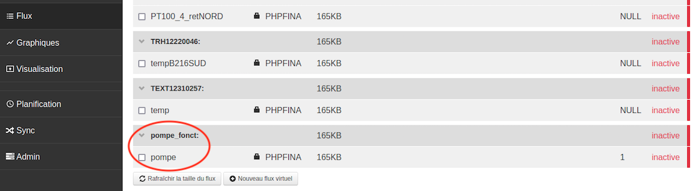

# Travail sur les données du Collège Marc Bloch 

Les données récoltées au collège Marc Bloch consistent essentiellement en les températures intérieures et extérieures, ainsi que des températures de chauffe, dans les différentes zones du bâtiment. Or, aucun capteur
n'a été installé qui puisse mesurer le fonctionnement de la pompe. Cependant, on peut déduire, à partir des données de température, à quels moments le chauffage est activé ou non :
il va donc s'agir de créer manuellement un flux pour le fonctionnement de la pompe, puis de le modifier afin qu'il corresponde au comportement réel du chauffage. 

Pour ce faire, il faudra paramétrer l'interface Emoncms afin de créer une nouvelle visualisation et de modifier les données directement sur la page web. 


## Au préalable 

Pour accéder à l'UI du routeur à distance : 
```
https://chaufferiedlcf.ddns.net 
  OU
176.178.161.180

User : root
Password : Taxo10in2xcw*
```

Au besoin, on pourra ouvrir une connexion *ssh* dans l'onglet *Nat* de l'UI du routeur. 


## Step 1 : créer le flux 

Pour créer le flux qui correspondra au fonctionnement de la pompe, on doit créer deux fichiers : 
* un fichier `.meta` : on copiera le meta de la température de départ du circuit d'eau ;
* un fichier `.dat` : il sera initialisé via Python pour ne contenir que des 1. Ce sera ce fichier qui par la suite sera modifié pour correspondre au comportement de la pompe. 

Pour écrire les données dans le fichier `.dat`, on utilisera la bibliothèque `struct` dans Python (voir [ici](https://docs.python.org/3/library/struct.html) la documentation de la librairie). 
On s'inspirera des fonctions `createMeta`, `createFeed` et `newPHPFina` disponible à [ce lien](https://github.com/alexandrecuer/tf_works/blob/master/BIOS/src/tools/phpfina.py). Ces fonctions permettent de créer un nouvel objet PHPFina, non relié à un flux Emoncms, en utilisant un tableau numpy. 


## Step 2 : faire reconnaître le flux par Emoncms 

Emoncms reconnaît des flux FINA associés à des métadonnées SQL : aussi, il faudra associer notre flux créé de toutes pièces à de telles métadonnées afin qu'il soit reconnu par Emoncms et apparaisse dans la liste des flux. 

Pour installer mysql pour python : 

```
sudo apt-get install -y python3-mysql.connector
```

Dans un script python, on commence par importer un connecteur :

```
import mysql.connector
```

> C.f fichier `mysql_test.py`

Lors de cette étape, on sera amené à manipuler la base de données d'Emoncms. Pour plus de détails sur la structure de cette base, on se référera à [ce lien](https://github.com/emoncms/emoncms/blob/master/default.emonpi.settings.php#L38) : on se retrouve sur la page de Redis, qui est un système de gestion de base de données et qui nous permet d'avoir accès à la structure de la base SQL `emoncms`.   


### Base de données `input`

Clé | Valeur | Description 
--|--|--
description | None | 
id | 145 | Numéro de l'input dans Emoncms 
name | battery status | Nom de la valeur retournée par l'input 
nodeid | 12211135 | Numéro du capteur 
processList | None | 

### Base de données `feeds`

Clé | Valeur | Description 
--|--|--
datatype | 1 | Type *feed realtime* 
engine | 5 | Type *PHPFina* (cf. [ce lien](https://github.com/emoncms/emoncms/blob/master/default.emonpi.settings.php) pour un descriptif des différents *engines*)
id | 1 | Numéro du flux (attribué selon l'ordre chronologique d'ajout) 
name | VAN_Text | Nom du flux 
public | None | 
size | 17662216 | Taille du flux 
unit | None | 
userid | 1 | Pour donner un flux à un user (ici user unique = Emoncms) 
value | 25,9 | Dernière valeur envoyée par le capteur associé 
time | 1623159590 | Temps Unix
tag | sofrel_Vantage | Famille du flux 


On pourra également se référer à ce [cours en ligne]( https://openclassrooms.com/fr/courses/918836-concevez-votre-site-web-avec-php-et-mysql/914508-ecrivez-des-donnees) afin de se familiariser avec la syntaxe PHP et la manipulation des bases de données. 

> Si l'on veut tester un programme PHP, il faut ouvrir une fenêtre dans un navigateur web. Pour ce faire, on crée un fichier `test.php` dans le répertoire /var/www/html, qui contiendra le code à tester. On ouvre ensuite une fenêtre web à l'adresse suivante : 
> ```
> 127.0.0.1/test.php
> ```


Une fois le flux créé et reconnu, il apparaît dans l'onglet *Feeds* d'Emoncms. Pour y accéder, il faudra tapper l'adresse `127.0.0.1/emoncms` dans un navigateur de recherche, puis se connecter avec le compte utilisateur `verdi` :




## Step 3 : visualiser le nouveau flux dans un graphe Emoncms
  
Les fichiers qui gèrent l'interface graphique d'Emoncms se trouvent [ici](https://github.com/emoncms/emoncms/tree/master/Modules/vis) (ou bien, sur la machine, au chemin suivant : `opt/openenergymonitor/emoncms/Modules/vis`).

On dupliquera le fichier `EditRealtime.php` pour ne pas casser cette visualisation : le nouveau fichier, appelé `EditRealtime2.php`, permettra la création des graphes où, d'une part, seront superposées les courbes de température intérieure et de tempérture de départ du circuit d'eau, et d'autre part, la courbe de fonctionnement de la pompe. 

Il faudra ensuite faire afficher `EditRealtime2` dans le menu déroulant de l'onglet visualisation d'Emoncms. 


## Step 4 : modifier le flux de fonctionnement de la pompe

Grâce à l'interface graphique nouvellement créée sur Emoncms, on pourra manuellement ajuster les valeurs de fonctionnement de la pompe. Pour ce faire, on s'appuiera sur le graphe supérieur : lorsqu'il y a corrélation entre la diminution de la température de chauffe et celle de la température intérieure, on peut en déduire que la pompe est à l'arrêt. 

On obtient via cette méthode le résultat suivant : 


