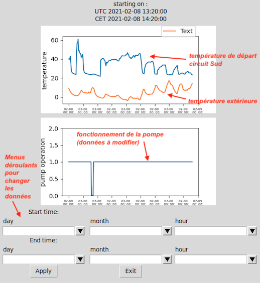

# Interface tkinter pour le traitement des données 

Dans ce dossier, on trouvera les fchiers Python permettant de mettre à jour le flux de fonctionnement de la pompe. Pour ce faire, on fait afficher une fenêtre tkinter dans laquelle on rentre les dates de modification du fonctionnement de la pompe. 
* `interfacePump.py` est le fichier principal, qui permet :
   * l'affichage des graphes de températures et de fonctionnement de la pompe 
   * de choisir sur quel laps de temps la pompe ne fonctionne pas, et ce aux vues des données de température 
   * de mettre à jour le fichier .dat du fonctionnement de la pompe en fonction de ces nouvelles entrées
* `steps.py` et `test.py` sont des fichiers tests contenant les premières versions de certaines parties du code final
* `test_PyFina.py` permet de récupérer et d'afficher les données PHPFina : c'est ce code qui est à la base du fichier `interfacePump.py`
* `tkinter_test.py` est un fichier test de la bibliiothèque tkinter, dans lequel on peut retrouver un certain nombre des fonctionnalités de base de cette librairie

#### Sources :

* [Tutoriel](https://youtu.be/Zw6M-BnAPP0) pour utiliser Matplotlib et les fonctionnalités Tkinter 
* [Page Wikibooks](https://fr.wikibooks.org/wiki/Programmation_Python/Tkinter) qui décrit les principes de base de Tkinter
* [Page Wikibooks](https://fr.wikibooks.org/wiki/Programmation_Python/Et_pour_quelques_widgets_de_plus...) qui explicite des fonctionnalités Tkinter plus avancées (notamment au nveau des widgets)

#### Updates :

* mettre en place les boutons suivants :
  * `Apply`: permet de redessinner le graphe de fonctionnement après avoir rentré les valeurs de dates
  * `Reset`: remet à zéro le fichier .dat 

* faire tourner le modèle RC avec les nouvelles données
* *in fine*, créer une nouvelle fenêtre où l'utilisateur pourrait rentrer la date de début du plot, ainsi que le circuit choisi (il faudrait alors créer d'autres fichiers .dat et .meta pour chaque circuit d'eau) 

#### Version finale : 

L'aventure tkinter ne s'étant pas révélée fructueuse, on laissera de côté cette solution, même si elle reste encore en cours de développement. Il peut être intéressant de profiter des bibliothèques GUI (*Graphical User Interface*) sur Python pour des applications simples et dans certains cas de figures ; or,  ici, toute l'interface graphique est déjà fournie par Emoncms, d'autant plus que c'est une interface travaillée et ergonomique. Aussi, Python ne fait pas le poids face à une application web de ce genre. 

Ci-dessous, un aperçu de la version finale de l'interface : 

À ce stade de développement, elle ne permet pas encore de modifier les données de fonctionnement de la pompe lorsque l'on change les valeurs des jours, mois et heures via les menus déroulants. 

