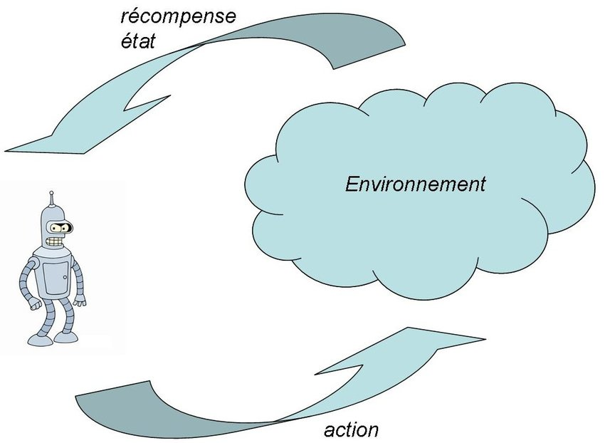
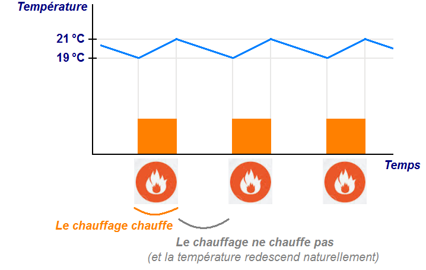
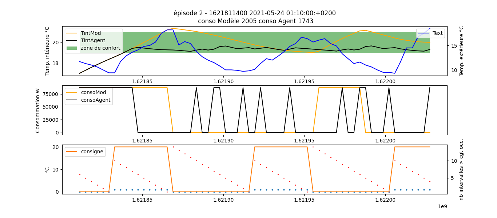
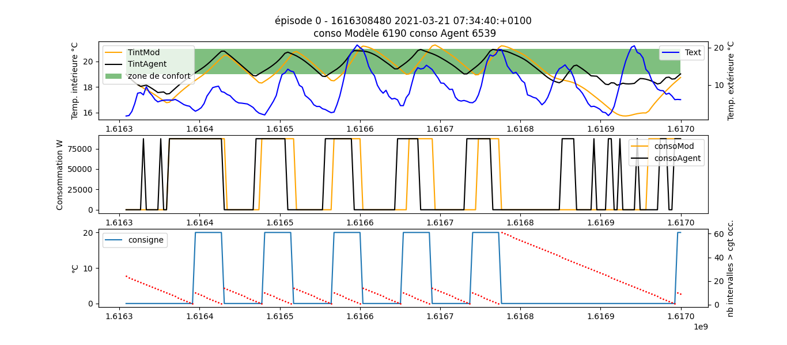
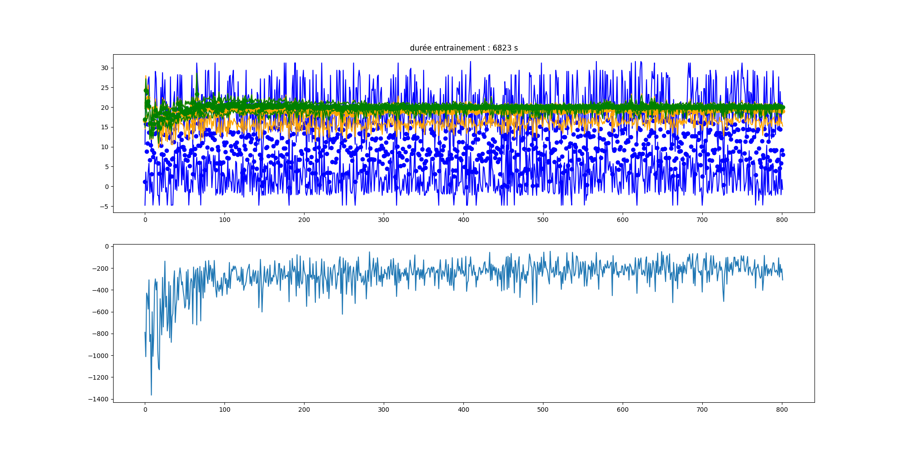
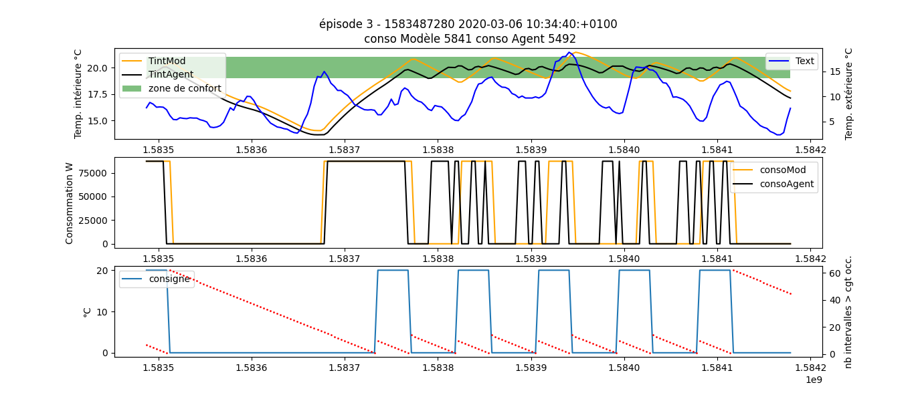

pour lire les fichiers binaires des flux de données avec numpy, installer PyFina :

```
python3 -m pip install PyFina
```
ou pour upgrader :
```
python3 -m pip install --upgrade PyFina
```
Pour nettoyer les valeurs aberrantes sur le flux 1 :

```
from PyFina import *
dir = "/var/opt/emoncms/phpfina"
trim(1, dir, 500)
```


# Pilotage des systèmes par un réseau neuronal

On souhaite piloter les installations énergétiques (pour le moment, le chauffage) d'un bâtiment via un système d'apprentissage renforcé. 


### Principes de l'apprentissage renforcé 

L'**apprentissage par renforcement** est une branche de l'intelligence artificielle qui "*consiste, pour un agent autonome (robot, etc.), à apprendre les actions à prendre, à partir d'expériences, de façon à optimiser une récompense quantitative au cours du temps*" (source [Wikipédia](https://fr.wikipedia.org/wiki/Apprentissage_par_renforcement)). 

Dans une telle situation d'apprentissage, on rencontre les éléments suivants :
* l'*agent* prend les décisions, c'est-à-dire qu'il choisit quelle action effectuer aux vues de son environnement ;
* l'*environnement* produit des états et des récompenses, quantités sur lesquelles s'appuie l'agent pour déterminer la politique à suivre (ensemble des actions choisies par l'agent et qui maximise l'apport en récompense). 




Dans notre cas, l'agent est représenté par un réseau de neurones (géré par la bibliothèque Python *TensorFlow*).

Plus précisemment, la méthode qui va être utilisée est la méthode du *Q-learning* (...)

> On crée un fichier général, nommé `RLtoolbox.py`, et qui comprend toutes les fonctions nécessaires au fonctionnement de l'algorithme RL, *quel que soit le modèle qu'on utilisera par la suite*. Ce fichier sera complété par d'autres codes de la forme `{nom modèle}.py` et qui contiendront les classes filles pour l'environnement et le modèle, ainsi que le main. 


### Première étape : hystérésis 

Soit *Tc* la température de consigne. On souhaite que la température intérieure reste comprise entre *Tc + hh* et *Tc - hh* avec *hh* intervalle de confort autour de la température de consigne. On prendra le plus souvent *Tc = 20 °C* et *hh = 1 °C*. 

Pour que la température intérieure reste dans la zone de confort définie, le système de chauffage va devoir effectuer une hystérésis : 
* le chauffage se met en marche lorsque *Tint* atteint 19°C ; 
* le système est à l'arrêt dès que *Tint* vaut 21°C. 

On obtient la courbe caractéristique suivante :



L'objectif, dans un premier temps, consiste à ce que l'agent reproduise ce comportement d'hysteresis. Le code permettant un tel fonctionnement correspond au fichier [trainHyst.py](trainHyst.py).

Après avoir entraîné l'agent sur 500 épisodes, on obtient ce type de comportement (l'agent est en noir) :



On note que l'on obtient bien le comportement souhaité, c'est-à-dire que la température intérieure reste constamment dans la zone de confort. L'agent est même plus efficient que le modèle car :
* la température ne quitte jamais la zone de confort (à part pour le point initial de température, qui a été généré aléatoirement) et oscille beaucoup moins autour de la consigne ;
* l'agent consomme moins que le modèle (1743 W contre 2005 W dans ce cas particulier).  


### Deuxième étape : prise en compte de l'occupation

L'algorithme précédant nous a permis d'obtenir un comportement d'hystérésis *quel que soit l'occupation effective du bâtiment*. Or, afin d'en optimiser la consommation énergétique, il est important de prendre en compte son occupation, en d'autres termes, de considérer les moments durant lesquels des personnes sont présentes dans la structure. En dehors de ces heures d'occupation, il n'est pas nécessaire de maintenir la température de consigne.

Désormais, notre objectif est de maintenir la température dans la zone de confort *seulement lorsque le bâtiment est occupé*. Dans le cas contraire, pendant le weekend notamment, aucune consigne de température n'est appliquée. 

Pour mettre en place un tel algorithme, on considère une nouvelle variable appelée **time of flight** (en pointillés rouges sur la figure ci-dessous) et qui correspond à la durée jusqu'à la prochaine période d'occupation. 

Le code correspondant à ce comportement est contenu dans le fichier [trainOcc.py](trainOcc.py).

> Attention à la CPU si on lance plusieurs entraînements à la suite ! En effet, si le processeur n'a pas le temps de vider la mémoire vive avant de commencer un nouvel entraînement, la machine va planter. 


Après avoir entraîné le réseau sur 200 épisodes, on obtient le résultat suivant : 




**Observations sur les résultats obtenus :**

On obtient des résultats assez disparates sur les différents entraînements réalisés. Chaque réseau qui résulte de ces entraînements présente l'un des comportements suivants : 
* la température reste dans la zone de confort, quelle que soit l'occupation du bâtiment ; 
* en période de non occupation, l'agent chauffe plus et la température est au dessus de la zone de confort ; 
* pour des réseaux moins entraînés, on se rapproche du comportement voulu (baisse de tempérture en non occupation).

En conclusion, la fonction *reward* implémentée ne convient pas aux objectifs recherchés. On tachera dorénavant de développer un nouveau système de récompense prenant en compte à la fois la température ET la consommation. 


### Troisième étape : recherche de la fonction *reward* optimale

Commu vu précédement, la fonction *reward* héritée du premier code n'aboutit pas à des résultats satisfaisants. Pour implémenter une nouvelle fonction qui réponde à nos objectifs, les pistes suivantes pourront être explorées :
* à partir de la récompense d'une hystérésis classique, pénaliser l'agent si celui-ci chauffe en période de non occupation ;
* prendre en compte à la fois la température de consigne et la consommation, avec un système de poids ;
* jouer sur les différents paramètres du Q-learning (comme *gamma*, qui joue sur la prise en compte des récompenses différées, ou bien *lambda*, qui traduit l'équilibrage entre exploration et exploitation) ;
* ...


> On pourra également s'intéresser à l'**Inverse Reinforcement Learning**, dont le but est de déterminer la fonction *reward* en se basant sur le comportement d'un "expert" (dans notre cas, le modèle qui réalise parfaitement l'hystérésis et l'arrêt de la chauffe en période de non occupation). 


**Fonction *reward* satisfaisante :**

```
def reward(self, datas, i):
  reward = -abs(datas[i, 2] - Tc)
  if datas[i, 3] == 0:
    if datas[i, 0] !=0:
      reward -= datas[i, 4] /10
  return reward 
```

La fonction implémentée fonctionne comme suit :
* la récompense (ou plutôt le malus) de base est celui utilisé dans le cas de l'hystérésis classique ; 
* dans le cas d'une période de non occupation, l'agent est pénalisé si et seulement s'il est en train de chauffer. Dans ce cas, la valeur de la pénalité correspond au *time of flight* (distance à la cible occupation) divisé par 10 (car sinon les valeurs de pénalité sont beaucoup trop importantes et il n'y a pas convergence). 

On aboutit au résultat suivant en terme d'évolution de la récompense, et pour un gamma de 0.9 : 



L'agent se comporte comme il le doit, c'est-à-dire qu'il procède à un hystérésis et arrête de chauffer en période de non occupation. Le seul bémol est que la consommation de l'agent reste supérieure à celle du modèle. 


**Influence du paramètre gamma :**

Il est intéressant d'observer quelle est l'influence du paramètre gamma sur la qualité de la politique de l'agent. Pour ce faire, en utilisant la fonction *reward* décrite ci-dessus et toutes choses égales par ailleurs, on fait varier gamma (à chaque fois sur une durée de 400 épisodes). 
* Pour gamma = 0.5, on n'a pas de convergence au niveau de la récompense, et le comportement de l'agent n'est pas du tout ce que l'on veut ;
* Pour gamma = 0.8, on ne peut pas vraiment parler de convergence de la récompense ; néanmoins, le comportement de l'agent est satisfaisant (on constate qu'il suit de près ou de loin le modèle). 


