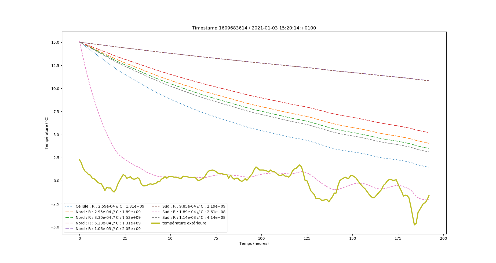
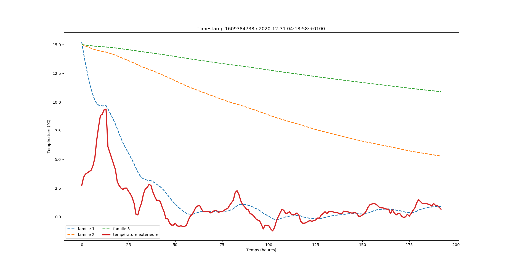
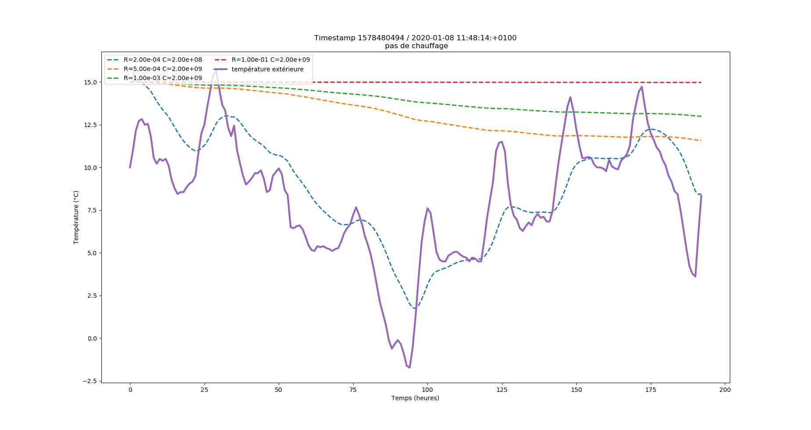
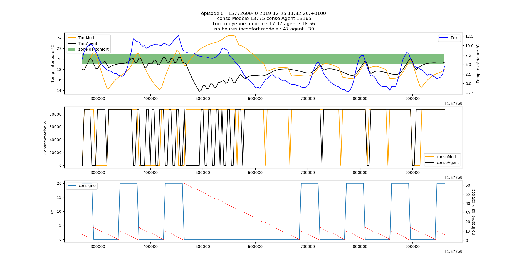

# Comparaison du comportement thermique du bâtiment en fonction des valeurs de R et de C 

Plusieurs optimisations ont été effectuées pour les différents circuits d'eau du Cerema, qui ont abouties à différentes valeurs pour R et C. On se propose maintenant de comparer ces différentes paires de valeurs du point de vue du comportement thermique du bâtiment :
* avec ou sans chauffage (modèle tout ou rien, dans le cas de la chauffe, la puissance est maximale)
* en hiver ou en été 

### Comparaisons des différents circuits 

Dans le tableau ci-dessous, on retrouve les paires de valeurs issues des différentes optimisations : 

Circuit | R | C 
--|--|--
Cellule | 2.59e-4 | 1.31e9
Nord | 2.95e-4 | 1.89e9
Nord | 3.30e-4 | 1.53e9
Nord | 5.20e-4 | 1.31e9
Nord | 1.06e-3 | 2.05e9
Sud | 9.85e-4 | 2.19e8
Sud | 1.89e-3 | 2.61e8
Sud | 1.14e-3 | 4.14e8 

On simule le comportement thermique du bâtiment via le modèle RC (convolution) ; on prendra comme condition initiale `T0 = 15`. On obtient le résultat ci-dessous :

### Identification des "grandes familles" de (R, C)

Su la figure ci-dessus, on remarque que les couples (R, C) peuvent être regroupés en 3 familles principales aux vues du comportement thermique qui leur est associé. Les 3 familles identifiées permettent ainsi d'avoir des ordres de grandeur que l'on peut facilement associer à un comportement thermique donné. 

Ci-dessous les différentes familles identifiées : 

Famille | R | C
--|--|--
1 | 2e-4 | 2e8
2 | 5e-4 | 2e9
3 | 1e-3 | 2e9

Ce qui donne en terme de comportement : 

 

On ajoutera une nouvelle paire (R, C) avec `R = 1e-1` et `C = 2e9`. Ces paramètres ne correspondent à aucune réalité physique mais permettent de visualiser un comportement extrême, de type "cave", comme sur la figure suivante : 

### Réaction de l'agent aux différentes familles 

Maintenant que ces différents ordres de grandeur ont été esquissés, on peut observer l'influence du changement des valeurs de R et C sur la convergence de l'agent. On teste ainsi sa *robustesse* etson *adaptabilité*. 3 réseaux, préalablement entraînés avec `R = 3.09e-4` et `C = 8.63e8`, ont été étudiés : 
* `complex3_bis.h5` et `4parsChh.h5` sont d'anciens réseaux, dont un qui a été mis en place sur le terrain (chaufferie du Cerema) ;
* `occupationdivisepar15.h5` est l'un des nombreux réseaux entraînés pendant la phase de recherche de la fonction reward optimale. 

Famille | Comportement observé 
--|--
1 | Dent-de-scie dans la zone de confort ; problème dès qu'il fait très froid (ni l'agent ni le modèle n'arrivent plus à suivre)
2 | Suit assez bien le modèle; léger décalage dans le déclenchement de la chauffe
3 | Beaucoup de start & stop ; l'agent ne descend pas en-dessous de 19°C, quite à surchauffer en non occupation 

Dans la grande majorité des cas l'agent s'adapte bien au changement des paramètres du modèle : on le retrouve bien dans la zone de confort en période d'occupation. 

Les cas problématiques concernaient exclusivement la première famille, comme on le verra dans la section suivante. 

### Timestamp problématique et interprétation physique 

Au cours des divers tests de robustesse des agents, on obtient la figure suivante (Noël 2019) : 

