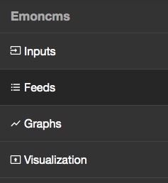
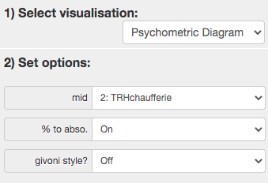
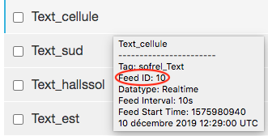

# Notice d'utilisation du système THEMIS 

Le système **THEMIS** (THermic and Energetic MonItoring System) permet de collecter les données du bâtiment (température, humidité, caractéristiques des circuits énergétiques, par exemple fonctionnement des pompes, etc.) et ainsi d'effectuer un suivi de ses performances énergétiques.  

## Présentation du système 

THEMIS se présente sous la forme d'un coffret, qui comprend tous les éléments nécessaires au traitement des données recueillies par les capteurs. Le système comporte : 
* un routeur 4G cellulaire auquel l'utilisateur doit se connecter pour avoir accès aux données recueillies ; 
* un capteur radio qui reçoit les informations venant des différents capteurs ;
* des blocs d'alimentation ;
* un appareil qui fait office de base de données en stockant tous les flux entrants.

## Installations préalables 

La programmation est faite en Python : on s'assurera dans un premier temps que Python est bien installé sur l'ordinateur qui sera utilisé pour manipuler les données. À défaut, 
on peut l'installer en suivant [ce lien](https://www.python.org/downloads/) (pour Windows et Mac). À noter que Python est installé par défaut sur les appareils Linux. 

Avant de continuer, il est toujours intéressant de vérifier que le système est à jour. Pour obtenir la version de Python qui tourne sur la machine, on entrera la ligne de commande suivante dans le terminal : 
```
python3 --version
```
puis 
```
python3 --upgrade
```
dans le cas où la version installée ne serait pas la dernière version disponible. 

Les données traitées seront de 2 types : 
* Les données récoltées par THEMIS sont de type *emoncms PHPFINA* ;
* Les données prises en charge par Python sont de type *PyFina* (une sous-classe de numpy np.ndarray). 

Pour manipuler ces données, il va falloir installer un certain nombre de packages Python. Pour ce faire, il faut ouvrir le terminal de l'ordinateur et y taper la ligne de 
commande suivante : 
* sur MacOS et Linux : 
```
python3 -m install PyFina 
```

* sur Windows : 
```
py -m pip install PyFina
```
On pourra tester ce nouveau package en suivant les instructions disponibles à [cette adresse](https://github.com/Open-Building-Management/PyFina/blob/main/README.md). 


## Manipulation des données 

### Manipulation directe des données Emoncms 

Pour accéder directement aux relevés des différentes données, on entre l'adresse suivante dans la barre de recherche d'un navigateur: 
INSÉRÉR ADRESSE IP  

On se retrouve alors avec un certain nombre d'onglets sur la gauche de l'écran : 



* *Inputs* correspond aux entrées du système (les différents capteurs et les grandeurs qu'ils mesurent) ;
* *Feeds* correspond aux données relevées, qui sont du type Emoncms PHPFINA ; 
* *Graphs* permet d'afficher l'évolution temporelle des grandeurs à différentes échelles et de construire certains graphes selon les besoins et objectifs de l'utilisateur ;
* *Visualisation* permet entre autre de visualiser les graphes de confort (graphiques psychrométriques). 

Pour afficher les graphes de confort, on se place dans l'onglet *Visualisation* puis on règle les paramètres comme suit : 



L'utilisateur pourra afficher différents graphes en fonction des zones qu'il souhaitera étudier (ici `TRH_chaufferie`est un exemple qui représente une zone donnée). 


### Importation des données Emoncms sous Python 

Afin de manipuler les données relevées par THEMIS sous Python, on procède à leur importation sur la machine en tant que données PyFina. Pour ce faire, on utilise la ligne de commande suivante dans le terminal : 

```
wget https://raw.githubusercontent.com/alexandrecuer/smartgrid/master/datasets/emoncms-backup-2020-04-22.tar.gz
# seulement un exemple, l'adresse ne sera pas celle-ci
```
puis
```
tar -xvf emoncms-backup-2020-04-22.tar.gz 
```

Il est possible que wget ne soit pas encore installé sur votre machine. Dans ce cas, il faudra procéder à son installation (pour [Windows](https://builtvisible.com/download-your-website-with-wget/) ou [Mac](https://www.maketecheasier.com/install-wget-mac/)). 

Une fois la tâche effectuée, on retrouvera le dossier contenant les données PyFina (les fichiers `.meta` et `.dat`).

> Les fichiers ainsi téléchargés se présentent sous la forma 'x.meta' ou 'x.dat' avec x un nombre entier. Ce nombre correspond au "feed number" que l'on pourra retrouver à l'adresse IP de gestion des données collectées, dans l'onglet *Feeds*. 




