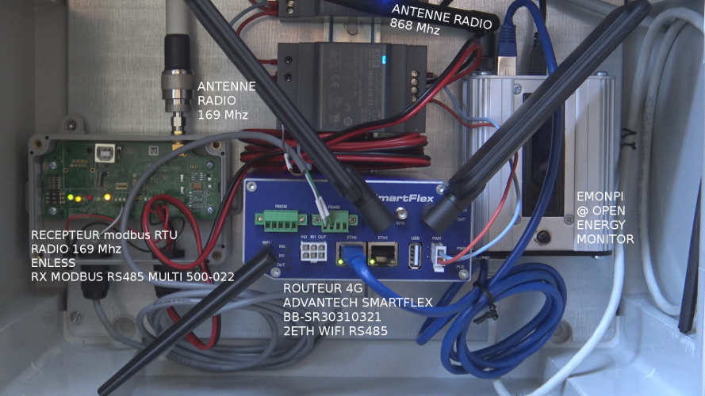
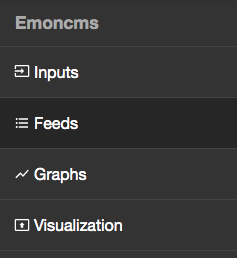
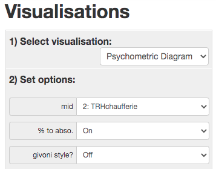
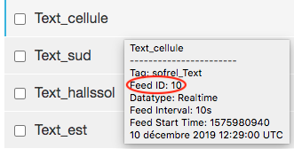

# Notice d'utilisation du système THEMIS 

Le système **THEMIS** (THermic and Energetic MonItoring System) permet de collecter les données du bâtiment (température, humidité, caractéristiques des circuits énergétiques, par exemple fonctionnement des pompes, etc.) et ainsi d'effectuer un suivi de ses performances énergétiques.  

## Présentation du système 

### Composantes matérielles 

THEMIS se présente sous la forme d'un coffret, qui comprend tous les éléments nécessaires au traitement des données recueillies par les capteurs. Le système comporte : 
* un routeur 4G cellulaire auquel l'utilisateur doit se connecter pour avoir accès aux données recueillies ; 
* un récepteur modbus qui reçoit les informations venant des différents capteurs (mode radio) ;
* des blocs d'alimentation ;
* un bloc EmonPI qui fait office de base de données en stockant tous les flux entrants.

[](https://dromotherm.github.io/documentation/pages/themis/overview.html)

Les différents éléments sont reliés entre eux via des liaisons série ; ainsi tous les composants dialoguent entre eux et se retrouvent connectés au micro-ordinateur. 

### Réseaux associés

Pour avoir accès aux données récupérées par le système physique, on utilise un certain nombre d'adresses IP et d'outils numériques. 

On peut se connecter directement au routeur via le réseau Wifi ou bien grâce à un port éthernet. On se retrouve alors connecté localement à la machine, et on pourra utiliser les adresses suivantes (chaque adresse permet de se connecter à un élément du système :
* `http://192.168.2.2/` : retourne le site Emoncms où se fait la visualisation des différentes données collectées (connexion à EmonPI) ;
* `https://192.168.2.1/`: permet d'accéder au routeur, qui gère l'accessibilité et la sécurité (connexxion au routeur) ;
* `http://192.168.2.2:1880/` : renvoie sur Node-RED, qui sera ensuite utilisé pour mettre en place un certain nombre de requêtes et instructions.   

Une autre possibilité est de se connecter depuis un smartphone ou un ordinateur portable via le réseau mobile à l'adresse suivante : 
```
https://ceremaida.ddns.net/
```
On pourra alors se connecter au système où que l'on se trouve dans le monde. 

> Cette dernière affirmation n'est pas totalement vraie : en effet, selon le réseau depuis lequel on se connecte, il se peut que certaines adresses soient fermées (par exemple, on ne peut pas accéder à Node-RED depuis les serveurs du Cerema pour des raisons de sécurité). 


## Initialisation du système 

### Installations préalables 

La programmation est faite en Python : on s'assurera dans un premier temps que Python est bien installé sur l'ordinateur qui sera utilisé pour manipuler les données. À défaut, 
on peut l'installer en suivant [ce lien](https://www.python.org/downloads/) (pour Windows et Mac). À noter que Python est installé par défaut sur les appareils Linux. 

Avant de continuer, il est toujours intéressant de vérifier que le système est à jour. Pour obtenir la version de Python qui tourne sur la machine, on entrera la ligne de commande suivante dans le terminal : 
```
python3 --version
```
puis 
```
pip install -U pip (MacOs et Linux)
python -m pip install -U pip (Windows)
```
dans le cas où la version installée ne serait pas la dernière version disponible. 

Les données traitées seront de 2 types : 
* Les données récoltées par THEMIS sont de type *emoncms PHPFINA* ;
* Les données prises en charge par Python sont de type *PyFina* (une sous-classe de numpy np.ndarray). 

Pour manipuler ces données, il va falloir installer un certain nombre de packages Python. Pour ce faire, il faut ouvrir le terminal de l'ordinateur et y taper la ligne de 
commande suivante : 
* sur MacOS et Linux : 
```
python3 -m pip install PyFina 
```

* sur Windows : 
```
py -m pip install PyFina
```
On pourra tester ce nouveau package en suivant les instructions disponibles à [cette adresse](https://github.com/Open-Building-Management/PyFina/blob/main/README.md). 


### Configuration du routeur 

Avant de pouvoir accéder aux données récoltées sur un appareil (ordinateur ou smartphone), il faut associer le routeur à l'adresse IP utilisée afin de créer une connexion entre le client (la machine de l'utilisateur) et le serveur (le routeur). Pour créer une telle connexion, on utilisera la bibliothèque `socket` dans Python. Un **socket** est un objet permettant de créer une connexion entre le client et le serveur. On pourra se familiariser avec cette bibliothèque à l'[adresse suivante](https://info.blaisepascal.fr/nsi-sockets-python). 


## Manipulation des données 

### Manipulation directe des données Emoncms 

Pour accéder directement aux relevés des différentes données, on entre l'adresse suivante dans la barre de recherche d'un navigateur (si l'on est connecté localement au routeur) : 
```
192.168.2.2
```

On se retrouve alors avec un certain nombre d'onglets sur la gauche de l'écran : 



* *Inputs* correspond aux entrées du système (les différents capteurs et les grandeurs qu'ils mesurent) ;
* *Feeds* correspond aux données relevées, qui sont du type Emoncms PHPFINA ; 
* *Graphs* permet d'afficher l'évolution temporelle des grandeurs à différentes échelles et de construire certains graphes selon les besoins et objectifs de l'utilisateur ;
* *Visualisation* permet entre autre de visualiser les graphes de confort (graphiques psychrométriques). 

Pour afficher les graphes de confort, on se place dans l'onglet *Visualisation* puis on règle les paramètres comme suit : 



L'utilisateur pourra afficher différents graphes en fonction des zones qu'il souhaitera étudier (ici `TRHchaufferie`est un exemple qui représente une zone donnée). Pour visualiser le graphe, on appuiera sur le bouton `Full screen`. 


### Paramétrage du visualiseur de données 

Par défaut, les modules présents dans EmonPI sont les onglets décrits précédemment. En fonction des besoins de l'utilisateur, on pourra être amené à personnaliser l'interface avec de nouveaux onglets spécifiques. 

Cette personnalisation se fait à l'aide d'une succession de lignes de commandes directement dans le terminal de la machine. On trouvera ci-dessous un certain nombre de ces instructions. 

Pour se connecter au visualiseur de données via une connexion sécurisée : 
```
ssh pi@192.168.2.2
```

Pour avoir un aperçu de l'architecture de la base de données : 
ls -al

Pour se diriger dans la branche contenant les données PHPFINA : 
cd /var/opt/emoncms/phpfina 

> Il s'agit du chemin classique d'arborification de telles données. Il faudra néanmoins penser à vérifier le chemin sur sa propre machine. 

pi@emonpi:/var/opt/emoncms/phpfina $ cd /var/www
pi@emonpi:/var/www $ ls
emoncms  html
pi@emonpi:/var/www $ em
-bash: em: command not found
pi@emonpi:/var/www $ cd emoncms
pi@emonpi:/var/www/emoncms $ ls
composer.json                index.php             route.php
COPYRIGHT.txt                Lib                   scripts
core.php                     LICENSE.txt           settings.env.ini
default.emonpi.settings.php  locale.php            settings.ini
default-settings.ini         Modules               tests
default-settings.php         param.php             Theme
docs                         php-info.php          version.txt
example.settings.ini         process_settings.php
example.settings.php         readme.md
pi@emonpi:/var/www/emoncms $ git status
On branch stable
Your branch is up to date with 'origin/stable'.

nothing to commit, working tree clean
pi@emonpi:/var/www/emoncms $ git remote set-url origin https://github.com/alexandrecuer/emoncms.git
pi@emonpi:/var/www/emoncms $ git pull
remote: Enumerating objects: 284, done.
remote: Counting objects: 100% (188/188), done.
remote: Compressing objects: 100% (31/31), done.
remote: Total 284 (delta 165), reused 178 (delta 157), pack-reused 96
Receiving objects: 100% (284/284), 173.91 KiB | 1.05 MiB/s, done.
Resolving deltas: 100% (202/202), completed with 79 local objects.
From https://github.com/alexandrecuer/emoncms
 * [new branch]        bios         -> origin/bios
 * [new branch]        psychrograph -> origin/psychrograph
 * [new branch]        themis       -> origin/themis
Your configuration specifies to merge with the ref 'refs/heads/stable'
from the remote, but no such ref was fetched.
pi@emonpi:/var/www/emoncms $ git checkout psychrograph
Branch 'psychrograph' set up to track remote branch 'psychrograph' from 'origin'.
Switched to a new branch 'psychrograph'
pi@emonpi:/var/www/emoncms $ exit


### Importation des données Emoncms en données PyFina 

Afin de manipuler les données relevées par THEMIS sous Python, on procède à leur importation sur la machine en tant que données PyFina. Pour ce faire, on utilise la ligne de commande suivante dans le terminal : 

```
wget https://raw.githubusercontent.com/alexandrecuer/smartgrid/master/datasets/emoncms-backup-2020-04-22.tar.gz
# seulement un exemple, l'adresse ne sera pas celle-ci
```
puis
```
tar -xvf emoncms-backup-2020-04-22.tar.gz 
```

Il est possible que wget ne soit pas encore installé sur votre machine. Dans ce cas, il faudra procéder à son installation (pour [Windows](https://builtvisible.com/download-your-website-with-wget/) ou [Mac](https://www.maketecheasier.com/install-wget-mac/)). 

Une fois la tâche effectuée, on retrouvera le dossier contenant les données PyFina (les fichiers `.meta` et `.dat`).

> Les fichiers ainsi téléchargés se présentent sous la forma 'x.meta' ou 'x.dat' avec x un nombre entier. Ce nombre correspond au "feed number" que l'on pourra retrouver à l'adresse IP de gestion des données collectées, dans l'onglet *Feeds*. 




### Manipulation des données PyFina sur Python

On ouvre un nouveau fichier où l'on recopiera les instructions ci-jointes. Lors de l'enregistrement, le nom du fichier devra porter l'extension `.py`.  

Le début du code correspond à l'importation des différents packages nécessaires : 
```
import numpy as np
import matplotlib.pylab as plt
import datetime
import time
from PyFina import PyFina, getMeta
```


