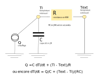
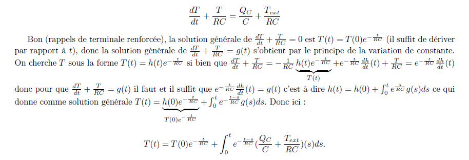
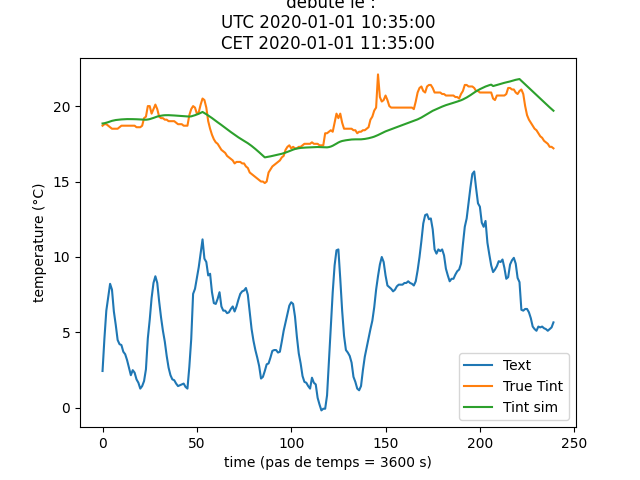

# RCmodel

On peut modéliser simplement un bâtiment via un modèle RC : selon cette analogie électrique, on peut représenter son comportement dynamique avec une résistance et une capacité. 

Si on prodcède à une loi des mailles / loi des noeuds, on aboutit à l'équation différentielle suivante qui régit le comportement dynamique du bâtiment :  

On peut donc modéliser l'évolution de la température interne par la fonction *T(t)*. 

Pour obtenir une estimation des valeurs de R et de C, on utilise le code `convo.py`. Le code procède comme suit : 
* on injecte les données relevées sur le terrain (valeurs de température extérieure, fonctionnement de la pompe, températures de départ et de retour des circuits d'eau, etc.) ;
* on procède à une optimisation via la méthode du gradient sur la fonction *F* (c.f ce [notebook](https://github.com/emmademareywilliams/stage/blob/main/RCmodel/RCmodel.ipynb), qui nous permet d'obtenir les valeurs optimales pour R et C ;
* ces valeurs sont ensuite utilisées pour simuler la température intérieure du bâtiment. 

Les résultats ainsi obtenus peuvent être comparés avec les vraies valeurs de température relevées sur le terrain : 

 

