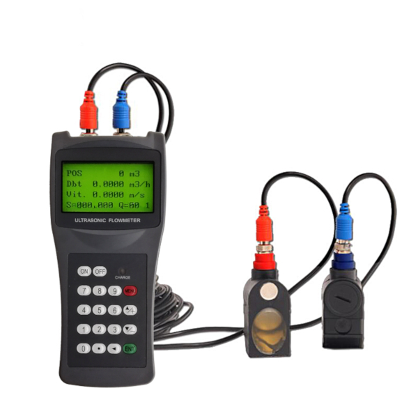

# Mesure des débits des circuits d'eau du Cerema 

Pour faire tourner le modèle RC, on s'est basé sur les valeurs de débit suivantes : 

Circuit | Débit (m3/h)  
--|--
Cellules | 5.19
Nord | 6.5
Sud | 4.2 

Or, ces valeurs ont été mesurées par des prestataires externes il y a de cela quelques années. Il est donc intéressant de procéder nous-même à une vérification de ces valeurs 
et à un suivi dans le temps (sur quelques semaines). Les objectifs de cette campagne de mesure sont les suivants :

* *Travailler avec des valeurs de débits plus exactes* : les pompes de la chaufferie du Cerema sont des matériels vieillissant, aussi on constate une perte de rendement au fil 
des années. Il est donc important, pour pouvoir modéliser au mieux le comportement thermique du bâtiment, de réactualiser les valeurs de débits. 
* *Effectuer un suivi temporel des valeurs de débit* : les mesures seront menées sur plusieurs semaines, à raison de 2 à 3 fois par semaine, afin de constater l'évolution des
différents débits (si évolution il y a). On pourra ainsi se rendre compte du comportement des pompes entre leur redémarrage et la stabilisation de leur fonctionnement en été. 

L'instrument de mesure de débit utilisé est un débitmètre à ultrasons portable de la marque Prisma Instruments : 

Ci-dessous, les données récoltées pour chaque circuit et à chaque date de mesure :

Date mesure // Circuit | Cellules | Nord | Sud | Est
 --|--|--|--|--
 **10/08** | 2.5 | 4 | 2.6 | 1.1
 **13/08** | 2.16 | 4.24 | 0.85 | 2.55 

