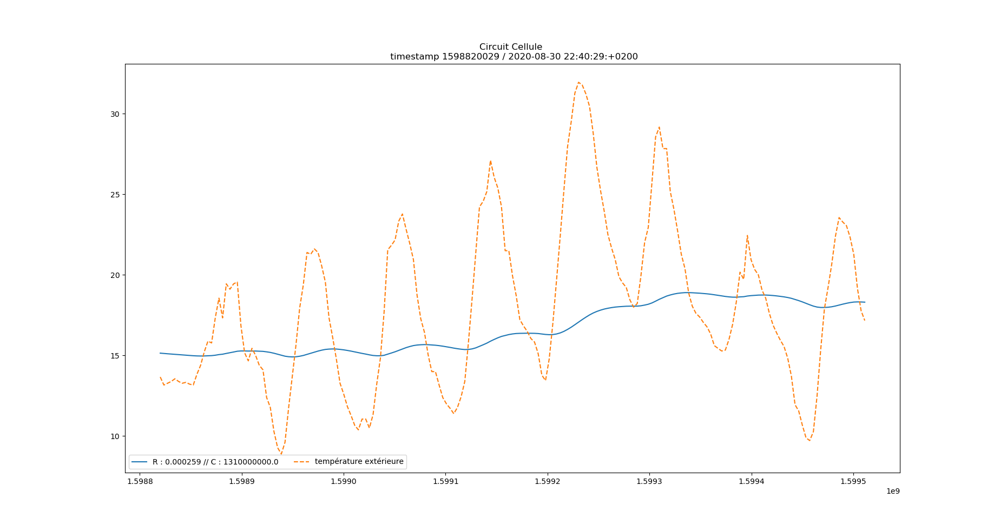
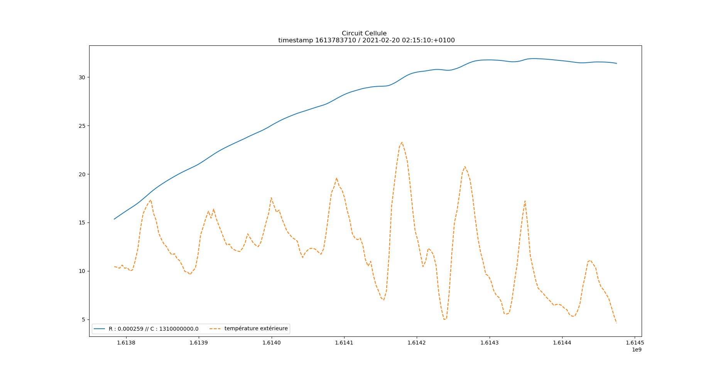

# Comparaison du comportement thermique du bâtiment en fonction des valeurs de R et de C 

Plusieurs optimisations ont été effectuées pour les différents circuits d'eau du Cerema, qui ont abouties à différentes valeurs pour R et C. On se propose maintenant de comparer ces différentes paires de valeurs du point de vue du comportement thermique du bâtiment :
* avec ou sans chauffage (modèle tout ou rien, dans le cas de la chauffe, la puissance est maximale)
* en hiver ou en été 

### Circuit cellule

Ici, pas de comparaison car on n'a qu'une seule paire de valeurs :

R | C 
--|--
2.59e-4 | 1.31e9

 

 

### Circuit Nord 

R | C 
--|--
2.95e-4 | 1.89e9
3.30e-4 | 1.53e9
5.20e-4 | 1.31e9
1.06e-3 | 2.05e9

### Circuit Sud 

R | C 
--|--
9.85e-4 | 2.19e8
1.89e-3 | 2.61e8
1.14e-3 | 4.14e8 
